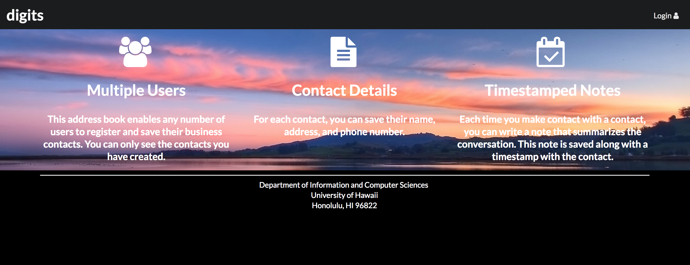
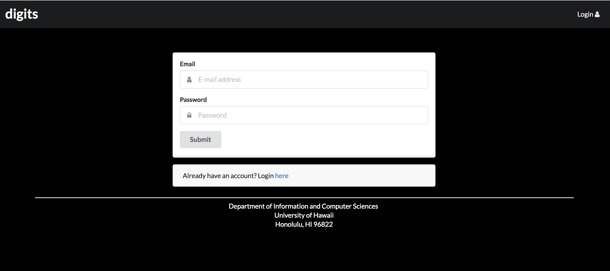
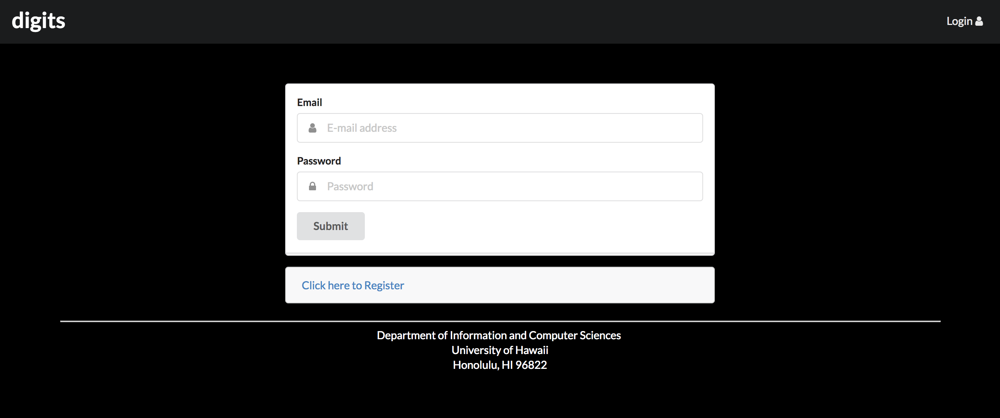
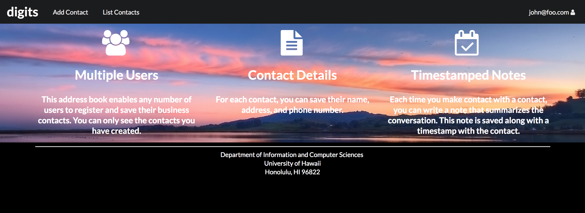
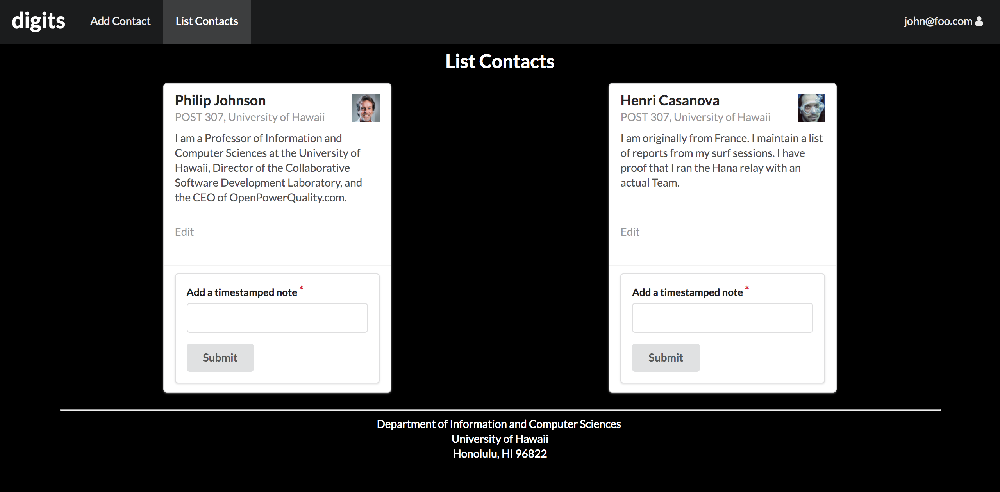
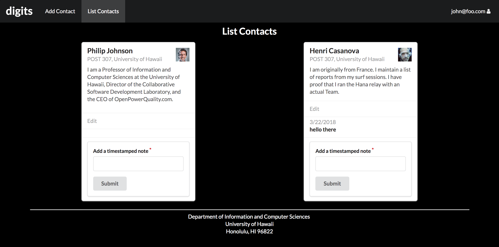
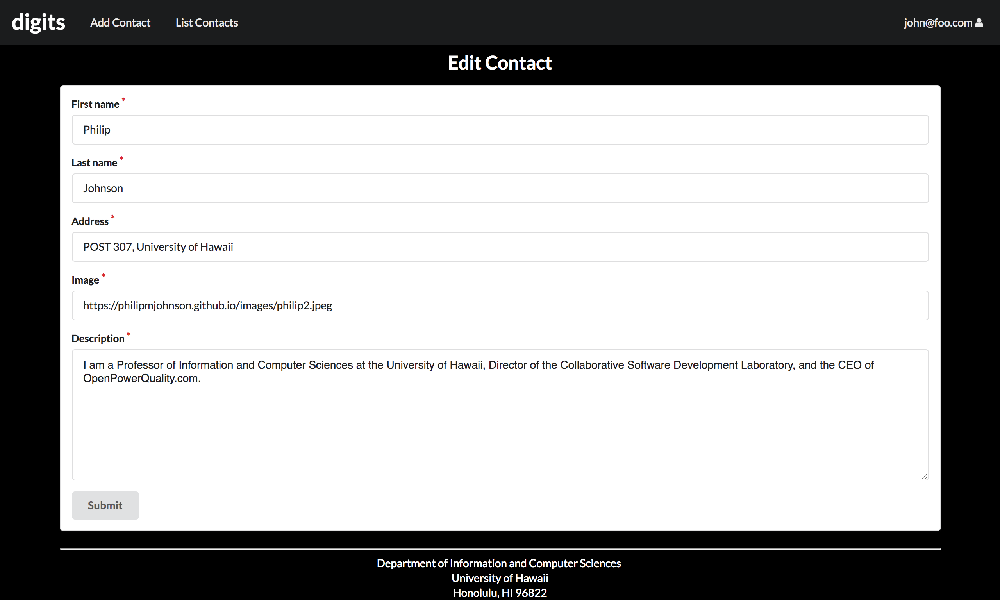
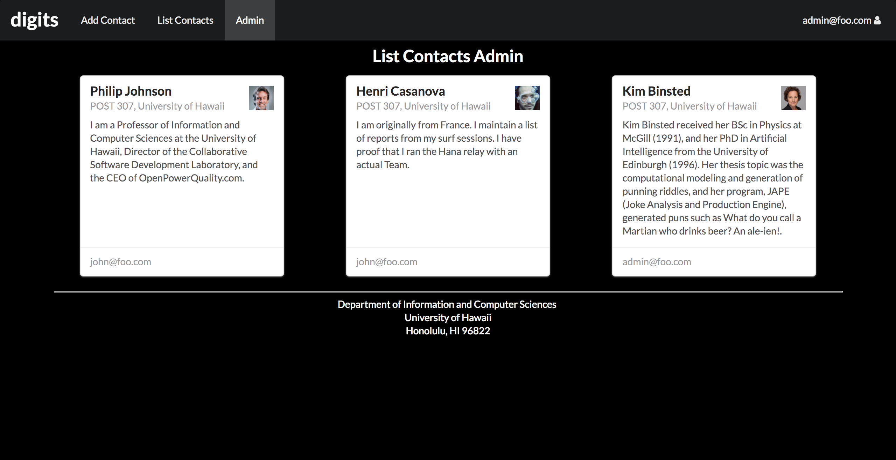

 #Digits

 

 
Digits is an application that allows users to: 
<ul>
<li>Register an account</li>
<li>Create and manage a set of contacts</li>
<li>Add timestamped notes regarding their interactions with each contact</li>
</ul>

##Installation
In order to install this application, follow these steps:
<ol>
<li><a href="https://www.meteor.com/install">Install Meteor</a></li>
<li>Request permission from the author to gain access to the Digits repo (Digits is a private repo)</li>
<li>Download a copy of Digits</li>
<li>cd into the app directory within digits</li>
<li>Run the following commands:
<ul>
  <li>$ meteor npm install</li>
  <li>$ meteor npm run start</li>
</ul>
Note that the first time you run the app, it will create some default users and data. 
Also, you can ignore any bycrypt warning.  
</li>
<li>Open a new tab in a browser window and navigate to <a href="http://localhost:3000">http://localhost:3000</a></li>
<li>Login to an account using the credentials in settings.development.json, or register a new account</li>
<li>Lastly, you can run ESLint over the code in the imports/ directory with the command: meteor npm run lint</li>
</ol>

##Digits Walkthrough
####Landing Page
When starting your application, you will see the landing page which provides an overview of the capabilities of Digits.

####Register
You can register a new account by clicking on “Login” then “Sign Up”.

####Sign in
Or you can sign into an existing account by clicking on "Login" then "Sign in".

####Home Page
Once logged in, the system takes you to the user's home page.  This is nearly identical to the landing page, but the NavBar contains links to list contact and add new contact pages.

####List Contacts
Clicking on the List Contacts link in the NavBar will bring up a page that lists all of the contacts associated with the logged in user.

On this page, you can add timestamped notes to any of your contacts.  

####Edit Contact
From the List Contacts page, you can edit the information associated with a contact by clicking on the “Edit” link for that contact.

####Admin User
Initially, one default admin user is created; however, there can by more than one users with the admin role.  Admin users have access to a special NavBar link "Admin" that retrieves a page listing all Contacts associated with all users.  

 Source: <a href="https://github.com/rcammack/digits"><i class="large github icon"></i>View on Github</a>